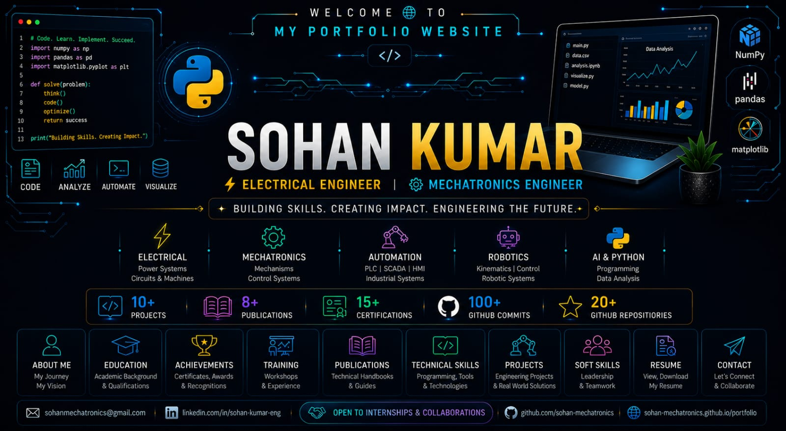

  

<h1 align="center">🌐 SOHAN KUMAR | PORTFOLIO WEBSITE</h1>

  <strong>Electrical Engineer • Mechatronics Engineer • Robotics • Industrial Automation • AI & Python</strong>

  Building innovative engineering projects, technical publications, and open-source learning resources.

---
# 👨‍💻 Portfolio Overview

Personal portfolio website showcasing my engineering journey, technical skills, projects, training, and career interests in **Mechatronics Engineering, Robotics, PLC, SCADA, Industrial Automation, and Electrical Engineering**.

## 👨‍🎓 About Me

Hi, I'm **Sohan Kumar**, a Mechatronics Engineering student with a Diploma in Electrical Engineering. I am passionate about Robotics, Automation, Artificial Intelligence, Industrial Control Systems, and emerging technologies.

# 🎓 Education

### 🏛 Bachelor of Engineering (B.E.) – Mechatronics Engineering
**Chandigarh University, Mohali, Punjab**

📅 **2025 – Present**

- Pursuing B.E. in Mechatronics Engineering (Lateral Entry)
- Focusing on Robotics, Industrial Automation, Control Systems, AI & Python
- Building engineering projects, technical publications, and open-source repositories

---

### ⚡ Diploma in Electrical Engineering
**Government Polytechnic Katihar, Bihar**

📅 **2022 – 2025**

📊 **Percentage:** **72.08%**

- Strong foundation in Electrical Machines, Power Systems, PLC, Sensors, Industrial Automation and Robotics
- Major Project: **Autonomous Hybrid Robot**

---

### 🏫 Matriculation (10th)
**R.K.S.S. Lakhan High School, Begusarai, Bihar**

📅 **2018**

📊 **Percentage:** **60%**

### Areas of Interest

* Robotics
* PLC & SCADA
* Industrial Automation
* Artificial Intelligence
* Electrical Engineering
* Embedded Systems

## 🛠️ Technologies Used

* HTML5
* CSS3
* Git
* GitHub Pages

## 📂 Features

* Personal Introduction
* Technical Skills Showcase
* Resume Download
* LinkedIn Profile Integration
* GitHub Profile Integration
* Responsive Design
* Professional Portfolio Layout

## 🌐 Live Website

https://sohan-mechatronics.github.io/Sohan-Mechatronics-Portfolio/

## 📄 Resume

My latest resume is available directly through the portfolio website.

## 🔗 Connect With Me

### GitHub

https://github.com/sohan-mechatronics

### LinkedIn

https://linkedin.com/in/sohan-kumar-eng

## 🎯 Career Goals

I aim to build a career in Robotics, Industrial Automation, PLC Programming, and Smart Engineering Systems while continuously developing practical and research-oriented skills.
## 📱 Scan to Connect

| GitHub | LinkedIn | Portfolio |
|:------:|:--------:|:---------:|
|  |  |  |

📲 <b>Scan any QR code to explore my work and connect with me.</b>

⭐ If you find this project useful, feel free to star the repository.